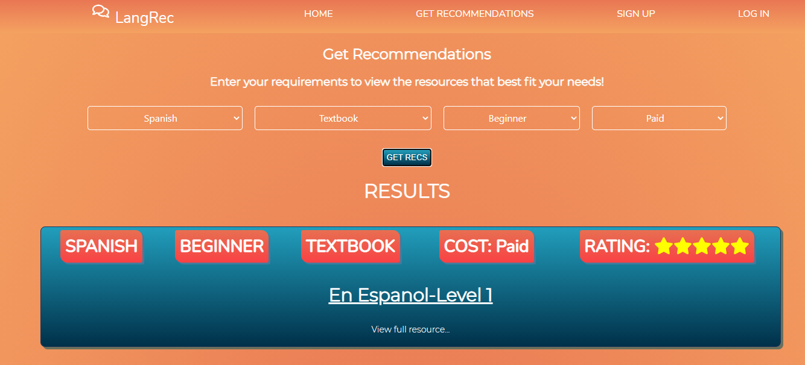
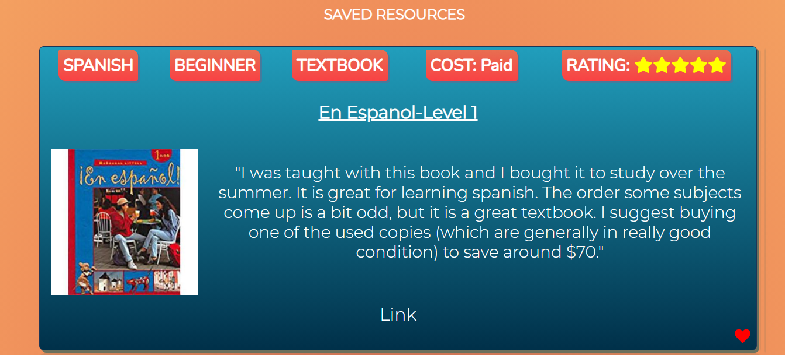

# LangRec

## Live Link

Visit [LangRec](https://langrec-app.vercel.app/)

## About LangRec

Using LangRec, users can get targeted recommendations for foreign language learning resources based on their learning style, language goals and current level.

## Technology

This fullstack application was built using:

- React

- Nodejs

- PostgreSQL

- Express

- HTML

- CSS

## Link to API Repo

[API Link](https://github.com/julialj95/langrec-api)

## Screenshots

#### Home Page

#### Login Page

#### Recommendations Page

#### Saved Resources Page

